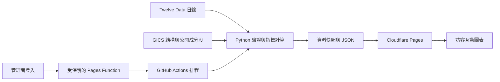

# GICS儀表板

以 S&P 500 成分股的真實日線，觀察產業相對 SPY 的強弱、動能、廣度與個股報酬。

**上線狀態（2026-09-28）：程式與遠端 CI 已通過；真實 API 連線已確認，全量資料正在更新。** Cloudflare 建立 Pages 專案時回傳 HTTP 500 / 8000000，尚未完成公開部署。最新狀態請看 [GitHub Actions](https://github.com/lee851104/sector_rotation/actions)。正式網站不提供虛構行情。

| 項目 | 首版行為 |
|---|---|
| 分析範圍 | 目前 S&P 500 成分股，GICS L1–L4 |
| 報酬口徑 | 每日等權重、拆股調整後價格報酬，不含股息 |
| 比較基準 | SPY（S&P 500 代理），不是官方指數序列 |
| 更新 | 美東週一至週五18:17；管理者手動觸發 |
| 資料失敗 | 保留前次成功結果，不以0或模擬數字填補 |
| 真實行情驗收 | SPY、AAPL、MSFT、BRK.B 各600筆成功；首次全量驗證待完成 |



## 目錄

沿用 ML 專案的資料/特徵/服務分層，但本專案沒有訓練模型。

```text
configs/                 # 更新設定、具來源日期的 GICS 對照表
src/gics/
  data/                  # 成分股、行情下載、配額、檢查點與品質
  features/              # 純指標計算：報酬、RS、廣度、輪動
  serving/               # 更新流程與 CLI
web/                     # 公開儀表板、管理頁、圖表
functions/               # Cloudflare：JWT 驗證、GitHub 工作控制
tests/{python,js,browser}/
scripts/                 # 打包與持久快照
data/                    # 本機資料；git 忽略
reports/figures/          # 本機 QA 截圖；git 忽略
docs/                    # 部署說明、規格、計畫、執行紀錄
.github/workflows/       # CI、排程與部署
DATA_CARD.md             # 資料來源、公式、已知偏差
Makefile                 # setup / smoke / data / test / build / serve
pyproject.toml + uv.lock # Python 環境與鎖定版本
```

## 本機執行

需要 Python 3.12+、uv、Node.js 22.12+。Windows 無需安裝 Make，可直接執行同樣命令：

```powershell
uv sync --locked
npm ci
uv run pytest -q
npm test
npm run build
npm run preview
```

瀏覽器開啟 `http://127.0.0.1:4173`。未放入 `data/state/dashboard.json` 時顯示未初始化；不含假數據。`npm run dev` 用於前端編輯；真實資料由 build 複製至部署目錄。

本機行情金鑰由環境變數 `TWELVE_DATA_API_KEY` 讀取；程式不自動讀 `.env`。若金鑰只在 GitHub Secrets，請用遠端工作流程測試，不要下載或貼出金鑰。

```powershell
uv run python -m gics.serving.pipeline --smoke
uv run python -m gics.serving.pipeline
npm run build
```

## GitHub 與 Cloudflare

完整步驟見 [部署說明](docs/deployment.md)。GitHub 儲存庫須有：

- `CLOUDFLARE_API_TOKEN`：Pages Write。
- `CLOUDFLARE_ACCOUNT_ID`：帳戶 ID。
- `TWELVE_DATA_API_KEY`：Twelve Data 金鑰。

把程式推到 main 後，工作流程會建立專用的 `sector-rotation` Pages 專案並部署介面，再到 GitHub Actions 手動選 **smoke** 驗證真實資料權限；通過後選 **update**。日後按排程執行。

免費資料方案每分鐘/每日有限額，全量約需一至兩小時；同日成功更新會跳過重複下載。**首次連線與收盤歷史是否涵蓋所有股票，要以你帳戶的實際回應為準。**

## 測試與資料限制

- 計算與下載測試：`uv run pytest -q`。
- 前端及管理 API 測試：`npm test`。
- 瀏覽器：`npx playwright install chromium`，再 `npm run build`、`npm run test:browser`。也可透過 `PLAYWRIGHT_CHROME` 指定本機 Chrome 完整路徑。
- 瀏覽器測試透過攔截請求注入人工資料，僅用於測試，不隨網站發布；QA 截圖也不代表真實市場。
- 公開名單目前可完整映射，但未來新增分類須人工核對。分類結構不是 GICS Direct 官方成分股服務。
- 真實行情公開展示授權尚未確認，已有 API Key 不表示取得公開資料授權；見 [資料說明](DATA_CARD.md)。
